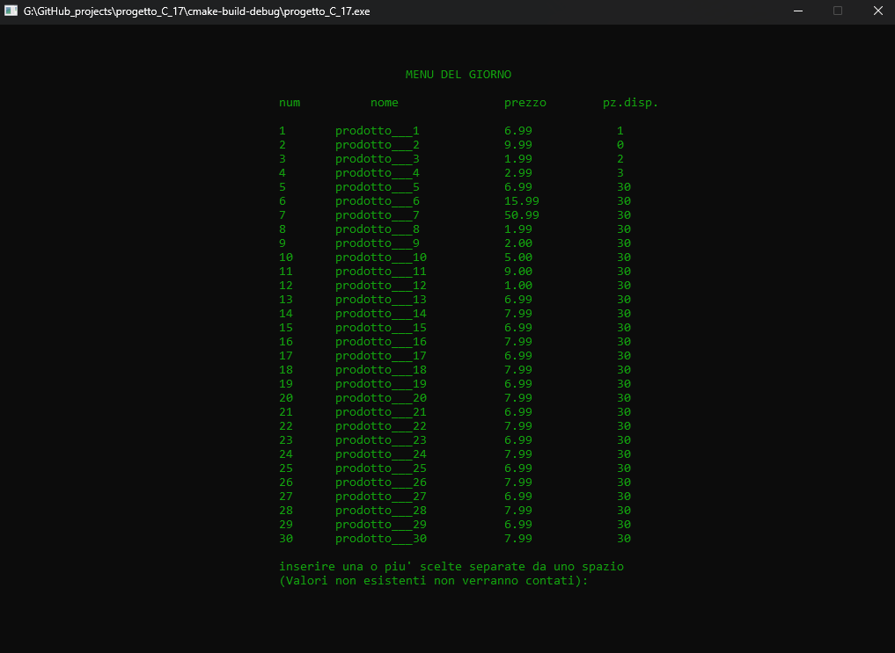

# Product Management System in C

## Author: Angello Pomayay

This project is a product management system written in C, specifically for managing a menu of products and their 
selling (I chose the context of a restaurant as an example of use). 
The project is divided into three main files: `main.c`, `servizio.h`, and `servizio.c`. This project was made by me as 
part of my university programming course, was intended to show what I learned during the course. 

## `servizio.h`

This header file contains the declaration of the data structures and functions used in the project.

- `prodotto`: This structure represents a product with fields for product code, name, price, and available quantity.
- `prodotto_scelto`: This structure represents a chosen product with fields for product code and quantity.
- `elenco_prodotti`: This structure represents a list of products. It contains an array of `prodotto` (with a maximum of 30 products), a status indicating if the menu has been loaded, and a length indicating the number of elements in the menu.

The functions declared in this file are:

- `c_menu(elenco_prodotti*)`: This function is used to load the menu into `elenco_prodotti`.
- `menu_status(elenco_prodotti*)`: This function returns the status of the menu.
- `menu_len(elenco_prodotti*)`: This function returns the length of the menu.
- `canc_menu(elenco_prodotti*)`: This function cancels the menu.

## `servizio.c`

This file contains the implementation of the functions declared in `servizio.h`.

- `c_menu(elenco_prodotti * mptr)`: This function loads the menu from a text file. The user is asked to input the name of the file. The function reads the file and populates the `elenco_prodotti` structure.
- `menu_status(elenco_prodotti * mptr)`: This function returns the status of the menu.
- `menu_len(elenco_prodotti * mptr)`: This function returns the length of the menu.
- `canc_menu(elenco_prodotti * mptr)`: This function cancels the menu if it has been loaded.

## `main.c`

The `main.c` file interacts with the `servizio.h` and `servizio.c` files. It uses the data structures and functions 
declared in `servizio.h` and implemented in `servizio.c` to manage the product menu. This includes loading the menu, 
checking the status and length of the menu, and cancelling the menu.

Overall, the `main.c` file orchestrates the operations of the product management system, providing an interface for 
the user to interact with the system and managing the flow of the application.

## Screenshots

